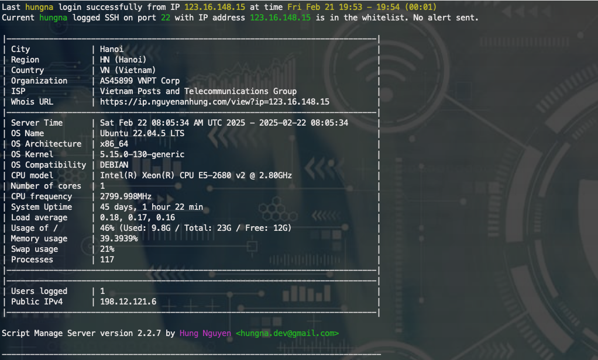

# Agent SSH Monitoring

Hàng ngày, có hàng tỉ lượt brute-force vào cổng SSH trên các server public cổng SSH này, có thể đó là cổng 22 mặc định.

Nó là khởi đầu cho vô vàn thảm hoạ, nếu hacker vào được server của bạn.

Hoặc giả dụ, bạn làm mất SSH Private Key, lộ SSH Password thì đây là công cụ bạn cần.

Nó giúp bạn ngay lập tức nhận được 1 tin nhắn tới Telegram nếu phát hiện có phiên đăng nhập vào SSH từ địa chỉ IP lạ.

Sẽ rất tốt nếu bạn có 1 VPN an toàn, whitelisted hoặc IP tĩnh.

Hoặc đơn giản, khai báo địa chỉ IP whitelisted vào file bash, hệ thống sẽ giúp bạn giám sát, cảnh báo sớm nếu có lượt
đăng nhập trái phép



## OS Supported

Script này hỗ trợ chạy trên các nền tảng Linux như Ubuntu/Debian, RHEL-based systems như CentOS, Rocky Linux,
AlmaLinux ...

## Pre install

Để chạy được scripts này, cần cài đặt 1 số gói cơ bản sau đây

Với RHEL-based systems

```shell
sudo yum install -y bc curl jq
```

Với Ubuntu/Debian systems

```shell
sudo apt install -y bc curl jq
```

## Installation

Step 1: Install scripts

```shell
curl -fsSL https://go.nguyenanhung.com/agent-ssh-alert -o /etc/profile.d/agent-ssh-alert.sh && chmod +x /etc/profile.d/agent-ssh-alert.sh
```

Step 2: Configure scripts

Mở file `/etc/profile.d/agent-ssh-alert.sh`

```shell
sudo vi /etc/profile.d/agent-ssh-alert.sh
```

### Cấu hình whitelist IP address

Tìm dòng

```shell
DEFAULT_WHITELIST_IP_ADDRESS=(
  "192.168.0.1"
  "127.0.0.1"
)
```

bổ sung hoặc thay thế các địa chỉ IP address cần whitelist, ví dụ

```shell
DEFAULT_WHITELIST_IP_ADDRESS=(
  "192.168.0.1"
  "127.0.0.1"
  "127.0.0.2"
)
```

Các địa chỉ IP được khai báo trong đây sẽ không bị cảnh báo khi đăng nhập SSH

### Cấu hình Telegram

Tìm dòng

```shell
export BOT_TOKEN="{{YOUR_TELEGRAM_ALERT_BOT_TOKEN}}" # Your Telegram Bot Token
export CHAT_ID="{{YOUR_TELEGRAM_SSH_ALERT_CHAT_ID}}" # Your Telegram ChatID / Chat Group ID
```

Thay thế các đoạn `{{YOUR_TELEGRAM_ALERT_BOT_TOKEN}}` và `{{YOUR_TELEGRAM_SSH_ALERT_CHAT_ID}}` bằng telegram bot token
và chat id tương ứng cần cấu hình

Tips: Tham khảo cách tạo Telegram Bot Token và Chat ID tại
đây: https://blog.nguyenanhung.com/2019/08/telegram-bot-ung-dung-trong-monitoring.html

```shell
export BOT_TOKEN="{{YOUR_TELEGRAM_ALERT_BOT_TOKEN}}" # Your Telegram Bot Token
export CHAT_ID="{{YOUR_TELEGRAM_SSH_ALERT_CHAT_ID}}" # Your Telegram ChatID / Chat Group ID
```

Bất kì phiên đăng nhập không hợp lệ, không được whitelist IPs sẽ được alert tới Telegram

### Finished

Sau khi cấu hình xong, lưu file lại là xong

Bấm esc -> sau đõ gõ lệnh `:wq!`

## Contact

| Name        | Email                | GitHub        | Facebook      |
|-------------|----------------------|---------------|---------------|
| Hung Nguyen | dev@nguyenanhung.com | @nguyenanhung | @nguyenanhung |

From 🐼 Bear Family with Love ♥️
